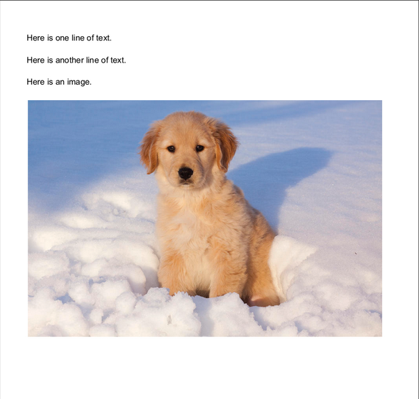
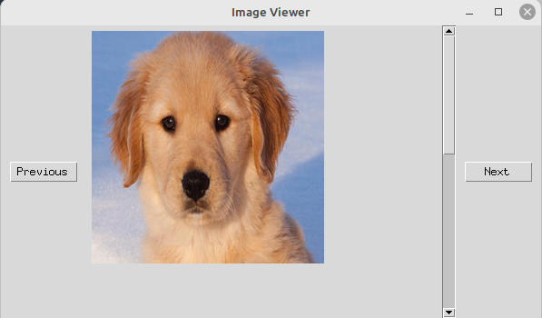

<!--
SPDX-FileCopyrightText: Copyright (c) 2024 NVIDIA CORPORATION & AFFILIATES. All rights reserved.
SPDX-License-Identifier: LicenseRef-NvidiaProprietary

NVIDIA CORPORATION, its affiliates and licensors retain all intellectual
property and proprietary rights in and to this material, related
documentation and any modifications thereto. Any use, reproduction,
disclosure or distribution of this material and related documentation
without an express license agreement from NVIDIA CORPORATION or
its affiliates is strictly prohibited.
-->

# Quickstart

## Important Documents

- [LICENSE](./LICENSE)
- [CONTRIBUTING.md](./CONTRIBUTING.md)
- [Continuous Integration](./ci/README.md)
  - [Building Ingest Service and Client Packages](./ci/README.md#building-and-publishing-packages)

## Links

- [NV Ingest Repository](https://gitlab-master.nvidia.com/dl/ai-services/microservices/nv-ingest)
- [Morpheus Repository](https://github.com/nv-morpheus/Morpheus)
- [Nemo Retriever Repository](https://gitlab-master.nvidia.com/drobison/devin-nemo-retrieval-microservice-private)
  - [Ryan Angilly's Engineering Overview of Nemo Retriever](https://nvidia-my.sharepoint.com/personal/rangilly_nvidia_com/_layouts/15/stream.aspx?id=%2Fpersonal%2Frangilly%5Fnvidia%5Fcom%2FDocuments%2FRecordings%2FRyan%20Angilly%20presents%20how%20Retriever%20Services%20work%2D20240124%5F120001%2DMeeting%20Recording%2Emp4&referrer=StreamWebApp%2EWeb&referrerScenario=AddressBarCopied%2Eview&ga=1)

# Table of Contents

- [NV-Ingest: what it is and what it is not.](#nv-ingest-what-it-is-and-what-it-is-not)
  - [What it is not](#what-it-is-not)
  - [What it is](#what-it-is)
- [Submitting documents to an existing ingest-service](#submitting-documents-to-an-existing-ingest-service)
- [Building the nv-ingest-ms-runtime container](#building-the-nv-ingest-ms-runtime-container)
- [Utilities](#utilities)
  - [nv-ingest-cli](./client/README.md)
  - [gen_dataset.py](#gen_datasetpy)
  - [image_viewer.py](#image_viewerpy)

## NV-Ingest: what it is and what it is not.

NV-Ingest is a microservice consisting of a container implementing the document ingest pipeline, a message passing service container (currently Redis), and optionally a Triton inference service container.

NV-Ingest can be deployed as a stand-alone service or as a dependency of a larger deployment, such as the Nemo Retriever cluster.

### What it is not

A service that:

- Runs a static pipeline or fixed set of operations on every submitted document.
- Acts as a wrapper for any specific document parsing library.

### What it is

A service that:

- Accepts a JSON Job description, containing a document payload, and a set of ingestion tasks to perform on that payload.
- Allows the results of a Job to be retrieved; the result is a JSON dictionary containing a list of Metadata describing objects extracted from the base document, as well as processing annotations and timing/trace data.
- Supports PDF, Docx, and images.
- Is in the process of supporting content extraction from a number of base document types, including pptx and other document types.
- Supports multiple methods of extraction for each document type in order to balance trade-offs between throughput and accuracy. For example, for PDF documents we support extraction via MuPDF, ECLAIR, and Unstructured.io; additional extraction engines can and will be added as necessary to support downstream consumer requirements.
- Supports or is in the process of supporting various types of pre and post processing operations, including text splitting and chunking; image captioning, transform, and filtering; embedding generation, and image offloading to storage.

## Submitting documents to an existing ingest-service

If you already have an existing service, you can submit documents to it using the `nv-ingest-cli` tool.

Pre-requisites:

- Install nv-ingest package dev: `pip install -e .` full-install: `pip install .`
- Install nv-ingest-client package: `pip install ./client/`

Full reference: [nv-ingest-cli](./client/README.md)

`Test.pdf` is a simple PDF document with text and images.



````shell
Submit ./data/test.pdf to the ingest service at localhost:6379, and extract text and images from it using the pymupdf
method.

```shell
nv-ingest-cli \
  --doc ./data/test.pdf \
  --output_directory ./processed_docs \
  --task='extract:{"document_type": "pdf", "extract_method": "pymupdf"}' \
  --client_host=localhost \
  --client_port=6379

ls ./processed_docs/*
processed_docs/image:
test.pdf.metadata.json

processed_docs/text:
test.pdf.metadata.json

````

View images; see: [image_viewer.py](#image_viewerpy)

```shell
python src/util/image_viewer.py --file_path ./processed_docs/image/test.pdf.metadata.json
```



```shell
cat ./processed_docs/text/test.pdf.metadata.json
[{
  "document_type": "text",
  "metadata": {
    "content": "Here is one line of text. Here is another line of text. Here is an image.",
    "content_metadata": {
      "description": "Unstructured text from PDF document.",
      "hierarchy": {
        "block": -1,
        "line": -1,
        "page": -1,
        "page_count": 1,
        "span": -1
      },
      "page_number": -1,
      "type": "text"
    },
    "error_metadata": null,
    "image_metadata": null,
    "source_metadata": {
      "access_level": 1,
      "collection_id": "",
      "date_created": "2024-03-11T14:56:40.125063",
      "last_modified": "2024-03-11T14:56:40.125054",
      "partition_id": -1,
      "source_id": "test.pdf",
      "source_location": "",
      "source_name": "",
      "source_type": "PDF 1.4",
      "summary": ""
    },
    "text_metadata": {
      "keywords": "",
      "language": "en",
      "summary": "",
      "text_type": "document"
    }
  }
]]

$ cat ./processed_docs/image/test.pdf.metadata.json
[{
  "document_type": "image",
  "metadata": {
    "content": "<--- Base64 encoded image data --->",
    "content_metadata": {
      "description": "Image extracted from PDF document.",
      "hierarchy": {
        "block": 3,
        "line": -1,
        "page": 0,
        "page_count": 1,
        "span": -1
      },
      "page_number": 0,
      "type": "image"
    },
    "error_metadata": null,
    "image_metadata": {
      "caption": "",
      "image_location": [
        73.5,
        160.7775878906,
        541.5,
        472.7775878906
      ],
      "image_type": "png",
      "structured_image_type": "image_type_1",
      "text": ""
    },
    "source_metadata": {
      "access_level": 1,
      "collection_id": "",
      "date_created": "2024-03-11T14:56:40.125063",
      "last_modified": "2024-03-11T14:56:40.125054",
      "partition_id": -1,
      "source_id": "test.pdf",
      "source_location": "",
      "source_name": "",
      "source_type": "PDF 1.4",
      "summary": ""
    },
    "text_metadata": null
  }
}]
```

## Building the nv-ingest-ms-runtime container

### Clone the Morpheus repository and checkout the 24.03 release tag.

```bash
git clone https://github.com/nv-morpheus/Morpheus.git
git checkout branch-24.03
git submodule update --init --recursive

./scripts/fetch_data.py fetch all # pull down all the LFS artifacts for Morpheus, including pre-built models
```

Note the path to the Morpheus repository; we will need it in the next step.

Go to the `nv-ingest` directory and open `.env` with your favorite editor, we will add some envrionment
variables.

`.env`

```bash
NV_INGEST_ROOT=[PATH TO NV INGEST ROOT]
MORPHEUS_ROOT=[PATH TO MORPHEUS ROOT]
MODEL_NAME=intfloat/e5-small-v2
DATASET_ROOT=./data
```

```bash
git clone https://gitlab-master.nvidia.com/dl/ai-services/microservices/nv-ingest
```

### Build Morpheus 24.03 (morpheus-ms-base:24.03) release container

```bash
docker compose build morpheus-ms-base
```

### Create Triton model

By default NV-Ingest does not require Triton, but if you are testing ingestion embedding creation (currently disabled),
image caption extraction, or other tasks that require Triton, you will need to create a Triton container and or model's
for the tasks you are testing.

### (Optional) Setting up Triton Inference Server with DeBerta caption extraction model.

Using `'--task="caption:{}"` requires that there is a Triton server running with the [DeBerta Caption Extraction
Model](./triton_models/README.md#deberta-caption-selection-model) loaded.

### (Optional) Setting up Triton Inference Server with Eclair model

Using `--task="extract:{'document_type': 'pdf', extract_method'='eclair}"` requires that there is a Triton server
running with the [ECLAIR Document OCR Model](./triton_models/README.md#eclair-document-ocr-model) loaded.

### Start supporting services

You can start Redis and Apache Tika services using the provided docker-compose file. Use `docker compose up` to
start one or both of them. Triton is optional at the moment -- unless you are testing ingestion embedding creation.

```bash
docker compose up -d redis tika
```

The `-d` option will start the containers in "detached" mode in the background.

Make sure the triton server is running and the models are loaded with no errors reported.

```bash
CONTAINER ID   IMAGE                COMMAND                  CREATED        STATUS        PORTS                                                 NAMES
bd740d31d753   redis/redis-stack    "/entrypoint.sh"         30 hours ago   Up 14 hours   0.0.0.0:6379->6379/tcp, :::6379->6379/tcp, 8001/tcp   devin-nv-ingest-redis-1
f8869d0dff68   apache/tika:latest   "/bin/sh -c 'exec ja…"   30 hours ago   Up 14 hours   0.0.0.0:9998->9998/tcp, :::9998->9998/tcp             devin-nv-ingest-tika-1
```

### Build the nv-ingest-ms-runtime container (nv-ingest-ms-runtime:24.03)

```bash
docker compose build nv-ingest-ms-runtime
$ docker compose run -d nv-ingest-ms-runtime
```

Verify `ingest service` is working as expected.

```bash
docker logs devin-nv-ingest-nv-ingest-ms-runtime-1
 ✔ Container devin-nv-ingest-nv-ingest-ms-runtime-1  Created                                                                                                                                                    0.0s
Attaching to nv-ingest-ms-runtime-1
nv-ingest-ms-runtime-1  | DEBUG:morpheus.utils.module_utils:Module 'nemo_document_splitter' was successfully registered with 'nv_ingest' namespace.
nv-ingest-ms-runtime-1  | DEBUG:morpheus.utils.module_utils:Module 'pdf_content_extractor' was successfully registered with 'nv-ingest' namespace.
nv-ingest-ms-runtime-1  | DEBUG:morpheus.utils.module_utils:Module 'redis_task_sink' was successfully registered with 'nv_ingest' namespace.
nv-ingest-ms-runtime-1  | DEBUG:morpheus.utils.module_utils:Module 'redis_task_source' was successfully registered with 'nv_ingest' namespace.
nv-ingest-ms-runtime-1  | INFO:root:Starting pipeline setup
nv-ingest-ms-runtime-1  | INFO:__main__:REDIS_HOST: redis
nv-ingest-ms-runtime-1  | INFO:__main__:REDIS_PORT: 6379
nv-ingest-ms-runtime-1  | INFO:root:Pipeline setup completed in 0.00 seconds
nv-ingest-ms-runtime-1  | INFO:root:Running pipeline
nv-ingest-ms-runtime-1  | DEBUG:asyncio:Using selector: EpollSelector
nv-ingest-ms-runtime-1  | INFO:morpheus.pipeline.pipeline:====Pipeline Pre-build====
nv-ingest-ms-runtime-1  | INFO:morpheus.pipeline.pipeline:====Pre-Building Segment: main====
nv-ingest-ms-runtime-1  | INFO:morpheus.pipeline.pipeline:====Pre-Building Segment Complete!====
nv-ingest-ms-runtime-1  | INFO:morpheus.pipeline.pipeline:====Pipeline Pre-build Complete!====
nv-ingest-ms-runtime-1  | INFO:morpheus.pipeline.pipeline:====Registering Pipeline====
nv-ingest-ms-runtime-1  | WARNING: Logging before InitGoogleLogging() is written to STDERR
nv-ingest-ms-runtime-1  | W20240312 06:46:27.592626    29 thread.cpp:137] unable to set memory policy - if using docker use: --cap-add=sys_nice to allow membind
nv-ingest-ms-runtime-1  | INFO:morpheus.pipeline.pipeline:====Building Pipeline====
nv-ingest-ms-runtime-1  | INFO:morpheus.pipeline.pipeline:====Building Pipeline Complete!====
nv-ingest-ms-runtime-1  | INFO:morpheus.pipeline.pipeline:====Registering Pipeline Complete!====
nv-ingest-ms-runtime-1  | INFO:morpheus.pipeline.pipeline:====Starting Pipeline====
nv-ingest-ms-runtime-1  | INFO:morpheus.pipeline.pipeline:====Pipeline Started====
nv-ingest-ms-runtime-1  | INFO:morpheus.pipeline.pipeline:====Building Segment: main====
nv-ingest-ms-runtime-1  | DEBUG:morpheus.utils.module_utils:Module 'redis_task_source' with namespace 'nv_ingest' is successfully loaded.
nv-ingest-ms-runtime-1  | INFO:morpheus.pipeline.single_output_source:Added source: <redis_listener-0; LinearModuleSourceStage(module_config=<morpheus.utils.module_utils.ModuleLoader object at 0x7f663a420760>, output_port_name=output, output_type=<class 'morpheus._lib.messages.ControlMessage'>)>
nv-ingest-ms-runtime-1  |   └─> morpheus.ControlMessage
nv-ingest-ms-runtime-1  | DEBUG:morpheus.utils.module_utils:Module 'pdf_content_extractor' with namespace 'nv-ingest' is successfully loaded.
nv-ingest-ms-runtime-1  | INFO:morpheus.pipeline.single_port_stage:Added stage: <pdf_extractor-1; LinearModulesStage(module_config=<morpheus.utils.module_utils.ModuleLoader object at 0x7f663a420bb0>, input_port_name=input, output_port_name=output, input_type=<class 'morpheus._lib.messages.ControlMessage'>, output_type=<class 'morpheus._lib.messages.ControlMessage'>)>
nv-ingest-ms-runtime-1  |   └─ morpheus.ControlMessage -> morpheus.ControlMessage
nv-ingest-ms-runtime-1  | DEBUG:morpheus.utils.module_utils:Module 'nemo_document_splitter' with namespace 'nv_ingest' is successfully loaded.
nv-ingest-ms-runtime-1  | INFO:morpheus.pipeline.single_port_stage:Added stage: <nemo_doc_splitter-2; LinearModulesStage(module_config=<morpheus.utils.module_utils.ModuleLoader object at 0x7f663a420ca0>, input_port_name=input, output_port_name=output, input_type=<class 'morpheus._lib.messages.ControlMessage'>, output_type=<class 'morpheus._lib.messages.ControlMessage'>)>
nv-ingest-ms-runtime-1  |   └─ morpheus.ControlMessage -> morpheus.ControlMessage
nv-ingest-ms-runtime-1  | DEBUG:morpheus.utils.module_utils:Module 'redis_task_sink' with namespace 'nv_ingest' is successfully loaded.
nv-ingest-ms-runtime-1  | INFO:morpheus.pipeline.single_port_stage:Added stage: <redis_task_sink-3; LinearModulesStage(module_config=<morpheus.utils.module_utils.ModuleLoader object at 0x7f663a420dc0>, input_port_name=input, output_port_name=output, input_type=typing.Any, output_type=<class 'morpheus._lib.messages.ControlMessage'>)>
nv-ingest-ms-runtime-1  |   └─ morpheus.ControlMessage -> morpheus.ControlMessage
nv-ingest-ms-runtime-1  | INFO:morpheus.pipeline.pipeline:====Building Segment Complete!====
```

## Utilities

### Example document submission to the nv-ingest-ms-runtime service

Each of the following can be run from the host machine or from within the nv-ingest-ms-runtime container.

- Host: `nv-ingest-cli ...`
- Container: `nv-ingest-cli ...`

Submit a text file, with no splitting.

**Note:** You will receive a response containing a single document, which is the entire text file -- This is mostly
a NO-OP, but the returned data will be wrapped in the appropriate metadata structure.

```bash
nv-ingest-cli \
  --doc ./data/test.pdf \
  --client_host=localhost \
  --client_port=6379
```

Submit a PDF file with only a splitting task.

```bash
nv-ingest-cli \
  --doc ./data/test.pdf \
  --output_directory ./processed_docs \
  --task='split' \
  --client_host=localhost \
  --client_port=6379
```

Submit a PDF file with splitting and extraction tasks.

**Note: (TODO)** This currently only works for pymupdf, eclair, and Unstructured.io; haystack, Adobe, and LlamaParse have
existing workflows but have not been fully converted to use our unified metadata schema.

```bash
nv-ingest-cli \
  --doc ./data/test.pdf \
  --output_directory ./processed_docs \
  --task='extract:{"document_type": "pdf", "extract_method": "pymupdf"}' \
  --task='extract:{"document_type": "docx", "extract_method": "python_docx"}' \
  --task='split' \
  --client_host=localhost \
  --client_port=6379

```

Submit a [dataset](#command-line-dataset-creation-with-enumeration-and-sampling) for processing

```shell
nv-ingest-cli \
  --dataset dataset.json \
  --output_directory ./processed_docs \
  --task='extract:{"document_type": "pdf", "extract_method": "pymupdf"}' \
  --client_host=localhost \
  --client_port=6379

```

Submit a PDF file with extraction tasks and upload extracted images to MinIO.

```bash
nv-ingest-cli \
  --doc ./data/test.pdf \
  --output_directory ./processed_docs \
  --task='extract:{"document_type": "pdf", "extract_method": "pymupdf"}' \
  --task='store:{"endpoint":"minio:9000","access_key":"minioadmin","secret_key":"minioadmin"}' \
  --client_host=localhost \
  --client_port=6379

```

### Command line dataset creation with enumeration and sampling

#### gen_dataset.py

```shell
python ./src/util/gen_dataset.py --source_directory=./data --size=1GB --sample pdf=60 --sample txt=40 --output_file \
  dataset.json --validate-output
```

This script samples files from a specified source directory according to defined proportions and a total size target. It
offers options for caching the file list, outputting a sampled file list, and validating the output.

### Options

- `--source_directory`: Specifies the path to the source directory where files will be scanned for sampling.

  - **Type**: String
  - **Required**: Yes
  - **Example**: `--source_directory ./data`

- `--size`: Defines the total size of files to sample. You can use suffixes (KB, MB, GB).

  - **Type**: String
  - **Required**: Yes
  - **Example**: `--size 500MB`

- `--sample`: Specifies file types and their proportions of the total size. Can be used multiple times for different
  file types.

  - **Type**: String
  - **Required**: No
  - **Multiple**: Yes
  - **Example**: `--sample pdf=40 --sample txt=60`

- `--cache_file`: If provided, caches the scanned file list as JSON at this path.

  - **Type**: String
  - **Required**: No
  - **Example**: `--cache_file ./file_list_cache.json`

- `--output_file`: If provided, outputs the list of sampled files as JSON at this path.

  - **Type**: String
  - **Required**: No
  - **Example**: `--output_file ./sampled_files.json`

- `--validate-output`: If set, the script re-validates the `output_file` JSON and logs total bytes for each file type.

  - **Type**: Flag
  - **Required**: No

- `--log-level`: Sets the logging level ('DEBUG', 'INFO', 'WARNING', 'ERROR', 'CRITICAL'). Default is 'INFO'.

  - **Type**: Choice
  - **Required**: No
  - **Example**: `--log-level DEBUG`

- `--with-replacement`: Sample with replacement. Files can be selected multiple times.
  - **Type**: Flag
  - **Default**: True (if omitted, sampling will be with replacement)
  - **Usage Example**: `--with-replacement` to enable sampling with replacement or omit for default behavior.
    Use `--no-with-replacement` to disable it and sample without replacement.

The script performs a sampling process that respects the specified size and type proportions, generates a detailed file
list, and provides options for caching and validation to facilitate efficient data handling and integrity checking.

### Command line interface for the Image Viewer application, displays paginated images from a JSON file

viewer. Each image is resized for uniform display, and users can navigate through the images using "Next" and "Previous"
buttons.

#### image_viewer.py

- `--file_path`: Specifies the path to the JSON file containing the images. The JSON file should contain a list of
  objects, each with an `"image"` field that includes a base64 encoded string of the image data.
  - **Type**: String
  - **Required**: Yes
  - **Example Usage**:
    ```
    --file_path "/path/to/your/images.json"
    ```

## Launch the Nemo Retriever pipeline with the nv-ingest-ms-runtime service

**Note:** if you have deployed nv-ingest-ms-runtime, redis, tika, or triton services, you will need to stop them before
starting the Nemo Retriever pipeline.

**Note:** Integration is experimental. As of 12 March, 2024 you will need to pull the Devin's experimental Nemo
Retrieval pipeline branch.

### Clone the experimental Nemo Retrieval pipeline branch

```bash
git clone https://gitlab-master.nvidia.com/drobison/devin-nemo-retrieval-microservice-private
git checkout devin_nv_ingest_integration
```

### Create a Nemo Retriever pipeline with the nv-ingest-ms-runtime service

You should see three new services `morpheus_ms`, `redis`, and `triton` in the docker compose ps output.

```bash
docker compose -f docker-compose.yaml -f docker-compose.override.gpu.yaml --build up

docker compose ps
Every 2.0s: docker compose ps                                                                                                                                                                                                                                              drobison-mint: Fri Feb  9 14:39:34 2024

NAME                                                         IMAGE                                                                            COMMAND                  SERVICE          CREATED        STATUS                    PORTS
devin-nemo-retrieval-microservice-private-elasticsearch-1    docker.elastic.co/elasticsearch/elasticsearch:8.12.0                             "/bin/tini -- /usr/l…"   elasticsearch    4 days ago     Up 2 days (healthy)       0.0.0.0:9200->9200/tcp, :::9200->9200/tcp, 9300/tcp
devin-nemo-retrieval-microservice-private-embedding-ms-1     nvcr.io/nvidian/nemo-llm/embedding-ms:f0cfd7168aac4cccd605e95355c895a158fee2b3   "/opt/docker_entrypo…"   embedding-ms     16 hours ago   Up 13 hours (healthy)     0.0.0.0:8080->8080/tcp, :::8080->8080/tcp
devin-nemo-retrieval-microservice-private-etcd-1             quay.io/coreos/etcd:v3.5.11                                                      "etcd -advertise-cli…"   etcd             4 days ago     Up 38 hours (healthy)     2379-2380/tcp
devin-nemo-retrieval-microservice-private-milvus-1           milvusdb/milvus:v2.3.5                                                           "/tini -- milvus run…"   milvus           4 days ago     Up 38 hours (healthy)
devin-nemo-retrieval-microservice-private-minio-1            minio/minio:RELEASE.2023-03-20T20-16-18Z                                         "/usr/bin/docker-ent…"   minio            4 days ago     Up 38 hours (healthy)     9000/tcp
devin-nemo-retrieval-microservice-private-nv-ingest-ms-runtime-1      nv-ingest-ms-runtime:24.03                                                                "/opt/conda/bin/tini…"   nv-ingest-ms-runtime      13 hours ago   Up 13 hours
devin-nemo-retrieval-microservice-private-otel-collector-1   otel/opentelemetry-collector-contrib:0.91.0                                      "/otelcol-contrib --…"   otel-collector   4 days ago     Up 38 hours               0.0.0.0:4317->4317/tcp, :::4317->4317/tcp, 0.0.0.0:13133->13133/tcp, :::13133->13
133/tcp, 0.0.0.0:55679->55679/tcp, :::55679->55679/tcp, 55678/tcp
devin-nemo-retrieval-microservice-private-pgvector-1         ankane/pgvector                                                                  "docker-entrypoint.s…"   pgvector         4 days ago     Up 2 days                 0.0.0.0:5433->5432/tcp, :::5433->5432/tcp
devin-nemo-retrieval-microservice-private-postgres-1         postgres:16.1                                                                    "docker-entrypoint.s…"   postgres         4 days ago     Up 2 days                 0.0.0.0:5432->5432/tcp, :::5432->5432/tcp
devin-nemo-retrieval-microservice-private-redis-1            redis:latest                                                                     "docker-entrypoint.s…"   redis            4 days ago     Up 38 hours               0.0.0.0:6379->6379/tcp, :::6379->6379/tcp
devin-nemo-retrieval-microservice-private-retrieval-ms-1     devin-nemo-retrieval-microservice-private-retrieval-ms                           "/bin/sh -c 'opentel…"   retrieval-ms     16 hours ago   Up 16 hours (unhealthy)   0.0.0.0:1984->8000/tcp, :::1984->8000/tcp
devin-nemo-retrieval-microservice-private-tika-1             apache/tika:latest                                                               "/bin/sh -c 'exec ja…"   tika             4 days ago     Up 16 hours               0.0.0.0:9998->9998/tcp, :::9998->9998/tcp
devin-nemo-retrieval-microservice-private-triton-1           nvcr.io/nvidia/tritonserver:23.12-py3                                            "/opt/nvidia/nvidia_…"   triton           18 hours ago   Up 16 hours               0.0.0.0:8000-8002->8000-8002/tcp, :::8000-8002->8000-8002/tcp
devin-nemo-retrieval-microservice-private-zipkin-1           openzipkin/zipkin                                                                "start-zipkin"           zipkin           4 days ago     Up 38 hours (healthy)     9410/tcp, 0.0.0.0:9411->9411/tcp, :::9411->9411/tcp
```

### Create collections for performance comparison, and export the collection ID's

Note: the collection ID will be associated with the pipeline specified in the request, and subsequent index and
query calls will use the associated pipeline.

The nv_ingest service hooks will run the pipeline defined in `[nemo_retriever]/pipelines/morpheus_extract_split.
mustache`, this will call out to the nv-ingest-ms-runtime to do pdf text extraction, and chunking, then
return the results to the Haystack pipeline for embeddings, and DocumentWriter component for upload.

See: `[nemo_retriever]/src/v1/document_indexing.py` for ingest API modifications.

```bash
curl http://localhost:1984/v1/collections?pretty=true \
> -H 'Content-Type: application/json' \
> -d '{"name": "my_collection", "pipeline": "nv_ingest_multimodal_extract_split"}'

{
  "collection": {
    "pipeline": "nv_ingest_multimodal_extract_split",
    "name": "test_collection",
    "id": "33e0b745-585d-44c6-8db0-b03b841ea50b"
  }
}

export MM_COLLECTION_ID=33e0b745-585d-44c6-8db0-b03b841ea50b

python ./retrieval/script/quickstart/upload.py \
 -c ${MM_COLLECTION_ID} \
 --metadata ingest::extract_method=pymupdf \
 --metadata ingest::extract=true \
 --metadata ingest::extract_text=true \
 --metadata ingest::extract_image=true \
 --metadata ingest::split=true \
 ./data/test.pdf

200 {'documents': [
{'id': 'de95ad1ecc4635ecb74f6cf16a0597428a1ff81cc31bd90273a83fa83da401d0', 'content': 'Here is one line of text. Here is another line of text. Here is an image.', 'format': 'pdf', 'metadata': {'_indexed_at': '2024-03-10T20:38:57.133789', 'document_type': 'text'}, 'indexed_at': '2024-03-10T20:38:57.133789'},
{'id': 'fca467dd085e833949c5c704cd08e76aa483f08078207b89861eca837084b27b', 'content': '<content>', 'format': 'image', 'metadata': {'_indexed_at': '2024-03-10T20:38:57.133789', 'document_type': 'image'}, 'indexed_at': '2024-03-10T20:38:57.133789'}
]}

curl "http://localhost:1984/v1/collections/${MM_COLLECTION_ID}/search?pretty=true"   -H 'Content-Type: application/json'   -d '{"query": "Give me the documents"}'

{
  "chunks": [
    {
      "id": "7702fa8083977416922d592f49a02694155d1b06498324d5ed9c959c2dc8ef2b",
      "content": "Here is one line of text. Here is another line of text. Here is an image.",
      "format": "text",
      "metadata": {
        "_indexed_at": "2024-03-10T20:32:03.883826",
        "document_type": "text",
        "empty": 0
      },
      "score": 0.35280707478523254
    },
    {
      "id": "fca467dd085e833949c5c704cd08e76aa483f08078207b89861eca837084b27b",
      "content": "A golden retriever puppy sits in the snow, looking at the camera.",
      "format": "image",
      "metadata": {
        "_indexed_at": "2024-03-10T20:38:57.133789",
        "document_type": "image",
        "kosmos2_prompt": "Describe the image:",
        "kosmos2_response": "{\"role\": \"assistant\", \"content\": \"<phrase>A golden retriever puppy</phrase> sits in <phrase>the snow</phrase>, looking at the camera.\", \"entities\": [{\"phrase\": \"A golden retriever puppy\", \"bboxes\": [[0.046875, 0.015625, 0.953125, 0.984375]]}, {\"phrase\": \"the snow\", \"bboxes\": [[0.015625, 0.015625, 0.984375, 0.984375]]}]}",
        "empty": 0
      },
      "score": 0.2679625153541565
    }
  ]
}
```
