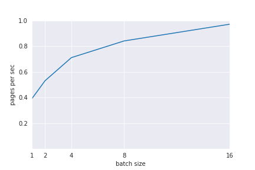

## Table of Contents

- [Overview](#overview)
- [General Prerequisites](#general-prerequisites)
- [Model Configurations](#model-configurations)
  - [DeBerta Caption Selection Model](#deberta-caption-selection-model)
  - [ECLAIR](#eclair-document-ocr-model)
  - [YOLOX](#yolox)
  - [E5-small-v2](#e5-small-v2)
- [Verifying Model Deployment](#verifying-model-deployment)
- [Troubleshooting Common Issues](#troubleshooting-common-issues)
- [Additional Resources](#additional-resources)

## Overview

This README provides specific instructions for constructing the Triton model directory for multiple models. Each section
focuses on the requirements for a particular model, including configuration files, model weights, and special backend
handling.

## General Prerequisites

Pull the Triton container and extend it with some common libraries.

`Dockerfile.caption`

```bash
pip install pandas torch transformers tensorrt torch transformers onnx
```

## Model Configurations

For our purposes we'll assume that the Triton service is launched with a local directory, `models`, volume mounted for
Triton to use.

### DeBerta Caption Selection Model

#### Pre-requisites

We'll use the [ngc-cli](https://org.ngc.nvidia.com/setup/installers/cli) tool to download the model.

#### Model acquisition

```bash
ngc registry model download-version "nvidian/nemo-llm/nemo-retriever-caption-classification-triton-pytorch:3" \
  --dest ./

mkdir -p ./scratch/caption_classification/onnx_conversion
mkdir -p ./scratch/caption_classification/trt_conversion
tar -xvf nemo-retriever-caption-classification-triton-pytorch_v3/3.tar.gz -C ./scratch/
```

#### Convert Model to ONNX / TRT

**Note:** If you encounter an error regarding 'permission-denied for hugging face cache creation, try setting HF_HOME
to a directory where you have write permissions.'

```bash
python ./src/util/trt_converters.py \
    --ckpt-path "./scratch/caption_classification/3/weights/fold0/model/model_0.pt" \
    --dynamic-batching \
    --engine-path "./scratch/model.plan" \
    --generate-onnx \
    --generate-triton-config \
    --generate-trt \
    --input-size 8 128 \
    --model-class-name "DebertaLargeModel" \
    --model-io-config '{"inputs":[{"name":"input_ids","dtype":"int64","shape":[128]},{"name":"input_mask","dtype":"float32","shape":[128]},{"name":"input_token_type_ids","dtype":"float32","shape":[128]}],"outputs":[{"name":"output","dtype":"float32","shape":[1]}]}' \
    --model-name "deberta_large" \
    --model-script-path "./triton_models/caption_classification/model_script.py" \
    --onnx-path "./scratch/model.onnx" \
    --overwrite \
    --triton-inputs "input_ids,input_mask" \
    --triton-repo "./triton_models" \
    --use-fp16
```

### ECLAIR Document OCR Model

In order to work around the limitations of GitLab CI/CD, relative URLs are used in `.gitmodules`:

```
[submodule "third_party/eclair_triton"]
	path = third_party/eclair_triton
	url = ../../../../edwardk/eclair-triton.git
	ignore = untracked
```

However, when you clone the repository locally, Git cannot deduce the URL correctly, so replace
the relative in `.gitmodules` with an absolute URL:

```
[submodule "third_party/eclair_triton"]
	path = third_party/eclair_triton
	url = ssh://git@gitlab-master.nvidia.com:12051/edwardk/eclair-triton.git
	ignore = untracked
```

After replacing `url` with the aboluste URL, checkout out the submodule:

```
git submodule update --init --recursive
```

The `eclair_triton` repository also hosts the model checkpoints as Git LFS files, so be sure to
pull the model weights as well:

```
git -C third_party/eclair_triton lfs pull
```

Using `--extract_method eclair` requires that there is a Triton server running.
To set up Triton, set the following environment variables in `.env`:

```
ECLAIR_CHECKPOINT_DIR=./third_party/eclair_triton/checkpoints
ECLAIR_CHECKPOINT_NAME=sweep_0_cooperative-swine_2024.04.20_22.35
ECLAIR_MODEL_DIR=./third_party/eclair_triton/models
ECLAIR_BATCH_SIZE=16
```

You may need to adjust the batch size depending on the GPU type.
The default batch size of 16 was optimized for A100.



First, build the base image:

```
docker compose -f third_party/eclair_triton/docker-compose.yaml build triton-trt-llm
```

Next, run the following to build a TensorRT model:

```
docker compose -f third_party/eclair_triton/docker-compose.yaml up build-eclair
```

Then, run the server:

```
docker compose -f docker-compose.yaml -f third_party/eclair_triton/docker-compose.yaml up triton-eclair
```

### YOLOX

To generate a YOLOX TensorRT engine, pull the LFS tracked pretrained model.

```bash
git lfs pull --include "best_ckpt.pth"
```

Once downloaded, run the export script below within the yolox directory to generate the TensorRT engine.

Note, this step will take a while to complete.

```
./export_trt_engine.sh
```

When complete, a TensorRT engine will be saved at the path below.

`yolox/1/model.plan`

At this point, the model is ready to be loaded in Triton.

### E5-Small-V2

TODO

### Model Conversion Tool Overview

[The Model Conversion Tool](../src/util/trt_converters.py) is a utility designed to facilitate the conversion of PyTorch
models into ONNX and TensorRT formats. This tool also aids in setting up the necessary configurations for deploying
models on the Triton Inference Server. Below is an overview of the tool's options and their functionalities.

#### Command-Line Options

- **`--ckpt-path`** (required): Path to the PyTorch model checkpoint file (state_dict).

  - Example: `--ckpt-path "/path/to/model_checkpoint.pt"`

- **`--device`**: Device to load the model on. Options are `cpu` or `cuda`. Defaults to `cpu`.

  - Example: `--device "cuda"`

- **`--dynamic-batching`**: Enables dynamic batching in Triton. This is a flag option.

  - Example: `--dynamic-batching`

- **`--engine-path`** (required): Path to save the TensorRT engine file.

  - Example: `--engine-path "/path/to/model.plan"`

- **`--generate-onnx`**: Generates an ONNX model. This is a flag option.

  - Example: `--generate-onnx`

- **`--generate-triton-config`**: Generates the Triton configuration file. This is a flag option.

  - Example: `--generate-triton-config`

- **`--generate-trt`**: Generates the TensorRT engine. This is a flag option.

  - Example: `--generate-trt`

- **`--input-size`**: Input size for the model in the format `(batch_size, sequence_length)`. Defaults to `(None, 128)`.

  - Example: `--input-size 8 128`

- **`--max-batch-size`**: Maximum batch size for Triton. Defaults to `8`.

  - Example: `--max-batch-size 16`

- **`--max-queue-delay`**: Maximum queue delay in microseconds for Triton dynamic batching. Defaults to `100`.

  - Example: `--max-queue-delay 200`

- **`--memory-pool-limit`**: Memory pool limit for the TensorRT builder in bytes. Defaults to `1 << 30`.

  - Example: `--memory-pool-limit 1 << 32`

- **`--model-class-name`** (required): Name of the model class in the script.

  - Example: `--model-class-name "DebertaLargeModel"`

- **`--model-name`** (required): Name of the model.

  - Example: `--model-name "deberta_large"`

- **`--model-script-path`** (required): Path to the PyTorch model script (Python file).

  - Example: `--model-script-path "/path/to/model_script.py"`

- **`--onnx-path`** (required): Path to save the ONNX model file.

  - Example: `--onnx-path "/path/to/model.onnx"`

- **`--overwrite`**: Overwrites existing ONNX and TensorRT models if they exist. This is a flag option.

  - Example: `--overwrite`

- **`--preferred-batch-sizes`**: Comma-separated list of preferred batch sizes. Defaults to powers of two between 1 and `max_batch_size`.

  - Example: `--preferred-batch-sizes "1,8,16,32"`

- **`--triton-repo`** (required): Path to the Triton model repository.

  - Example: `--triton-repo "/path/to/triton/repo"`

- **`--use-fp16`**: Enables FP16 precision. This is a flag option.

  - Example: `--use-fp16`

- **`--use-int8`**: Enables INT8 precision. This is a flag option.

  - Example: `--use-int8`

- **`--triton-inputs`**: Comma-separated list of input names to include in the Triton config.

  - Example: `--triton-inputs "input_ids,input_mask"`

- **`--model-io-config`** (required): JSON string defining model inputs and outputs.

##### Understanding `--model-io-config`:

This option requires a JSON string that defines the model's inputs and outputs. Each input and output should have the following attributes:

- `name`: The name of the input/output tensor.
- `dtype`: The data type of the tensor (e.g., `int64`, `float32`).
- `shape`: The shape of the tensor.

###### Example of `--model-io-config`:

For a model with three inputs (`input_ids`, `input_mask`, `input_token_type_ids`) and one output (`output`), you would specify the following:

```json
{
  "inputs": [
    { "name": "input_ids", "dtype": "int64", "shape": [128] },
    { "name": "input_mask", "dtype": "float32", "shape": [128] },
    { "name": "input_token_type_ids", "dtype": "float32", "shape": [128] }
  ],
  "outputs": [{ "name": "output", "dtype": "float32", "shape": [1] }]
}
```

You would pass this configuration to the command as follows:

```bash
--model-io-config '{"inputs":[{"name":"input_ids","dtype":"int64","shape":[128]},{"name":"input_mask","dtype":"float32","shape":[128]},{"name":"input_token_type_ids","dtype":"float32","shape":[128]}],"outputs":[{"name":"output","dtype":"float32","shape":[1]}]}'
```
